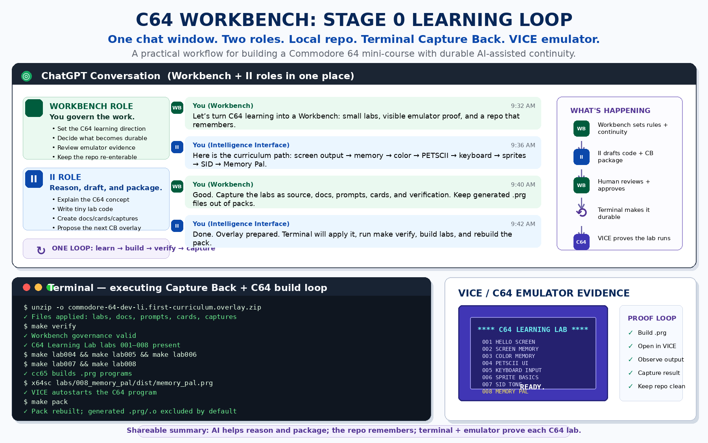

# C64 Workbench Stage 0 Learning Loop Infographic



## What this visual shows

This infographic adapts the general Workbench Stage 0 workflow to the Commodore 64 Learning Lab.

The C64 Workbench loop is:

```text
one ChatGPT conversation -> two roles -> terminal Capture Back -> local repo -> cc65 build -> VICE emulator evidence -> packed Workbench continuity
```

## Roles

- **Workbench role** governs the work: learning direction, repo custody, rules, review, and what becomes durable.
- **II role** reasons and produces: explanations, C64 lab source code, docs, prompts, cards, and Capture Back packages.
- **Terminal** applies the durable repo changes, runs verification, builds `.prg` files, opens VICE, and regenerates packs.
- **VICE / C64 emulator** provides visible evidence that each lab actually runs.

## Why it helps a newcomer

The image is intended as a quick handoff artifact for someone like Hernan. It explains why the repo is more than a pile of C64 experiments: it is a learning loop where each tiny program becomes a verified, re-enterable Workbench artifact.

## Current curriculum shown

```text
001 Hello Screen
002 Screen Memory
003 Color Memory
004 PETSCII UI
005 Keyboard Input
006 Sprite Basics
007 SID Tone
008 Memory Pal
```

## Source pattern

This C64-specific visual follows the Stage 0 product-builder pattern: one chat window, two roles, and a terminal that makes the Capture Back loop durable.
