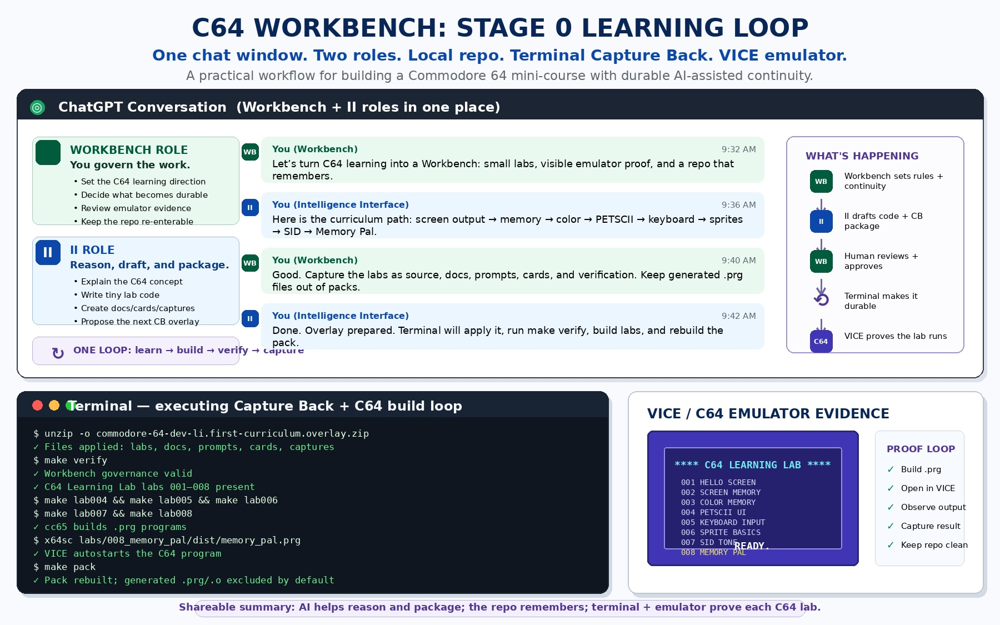

# C64 Workbench Stage 0 Learning Loop — Hernan Copy

This page captures the shareable explanation for the C64 Workbench Stage 0 Learning Loop infographic.

## Companion copy

This infographic shows the workflow behind the C64 Learning Lab. The project is not just random C64 examples — it is a repeatable loop.

We use the conversation to design the next small lab, then capture that into a local repo as source code, docs, prompts, cards, and verification rules. `make verify` checks that the Workbench is still coherent. cc65 builds real C64 `.prg` files. VICE runs them in an emulator so each lesson has visible evidence.

Each lab teaches one machine concept: screen memory, color memory, PETSCII, keyboard input, sprites, SID sound, and then a tiny Memory Pal app. The loop is: idea → repo → verify → build → run in emulator → capture back → next lab.

The goal is a re-enterable learning system, not just a pile of snippets.

## How to use this shareable

Send Hernan the image plus the companion copy above. The image explains the workflow at a glance; the copy explains why the workflow matters: conversation creates direction, the repo preserves continuity, verification keeps the Workbench coherent, cc65 builds real C64 programs, and VICE provides visible emulator proof.

## Workbench meaning

The Workbench loop turns a casual AI-assisted programming session into a durable learning system. Each lab has a small concept, a runnable program, expected behavior, and a Capture Back record. That makes the project re-enterable later by Steven, Hernan, or another reviewer.
